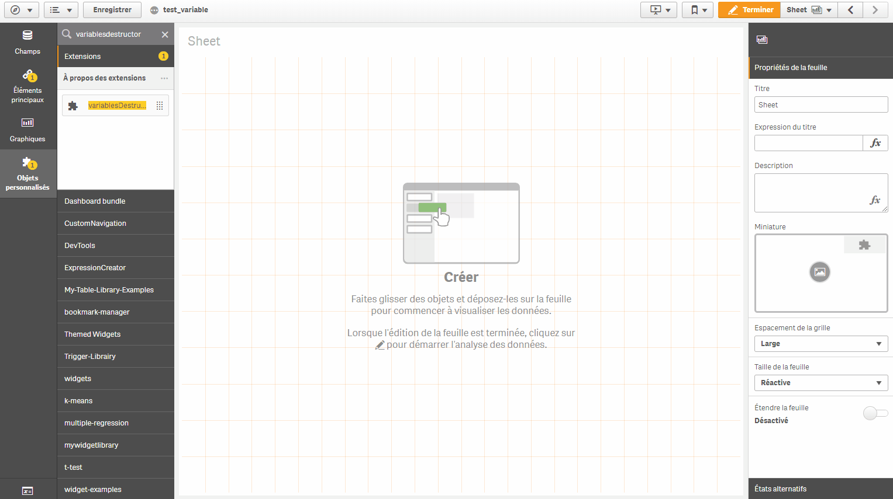

# Qlik Sense Variables Destructor

This is a Qlik Sense extension to destroy many variables in an application.

**Author:** Baptiste Durand

**License**: MIT Licensed  

# Disclaimer

Created for a personal use.
This is NOT A QLIK PRODUCT. This is not supported.
No warranty, use at your own risks.
Not Documented.

# Use case

Sometimes, when we develop an Qlik Sense application, we create many variables by the load script.
Deleting variables through UI (Edit mode) is one by one for the "Design" variables. It cannot be done directly for script variables.
My use case was to delete all variables to reinit an application before to deploy it into production.

# Example

How can I use it?

# How it works

Specify which kind of variable to delete.
It is possible to specify a list of variables or a search string (case sensitive).

## Warning :
No confirmation popup!

In case of a huge amount of variables, I recommend to wait until the processing is finished before another action.

Browser web development console allows to follow the process.

# Pre-requisite

Qlik Sense >=3

# Limitations

For an utilization with Qlik Sense Desktop, use it in an external browser (Chrome or Mozilla).

Reminder, Url should be :

`http://localhost:4848/hub/`

